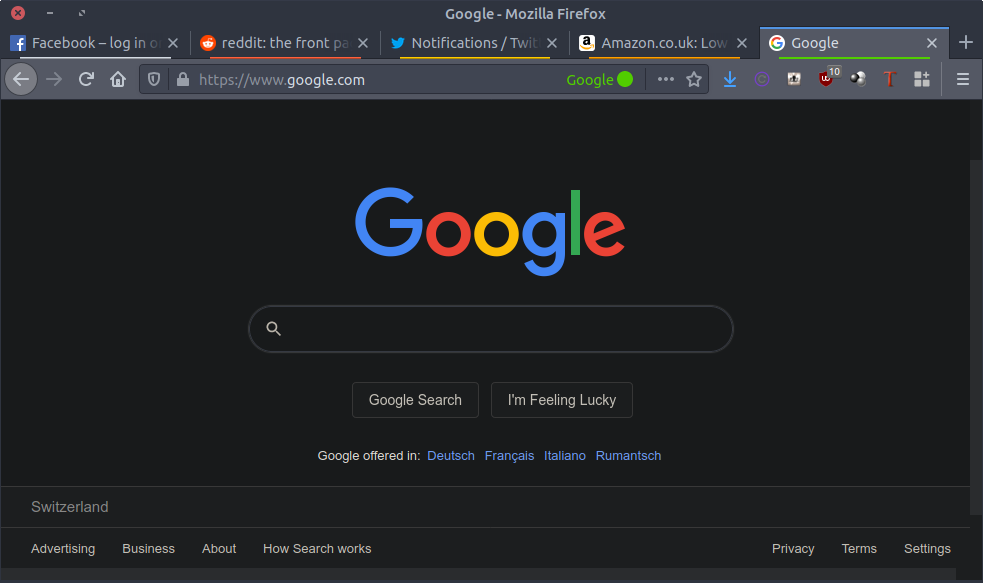

# browsers

Note that this repository is not fully tested.

This is a browsers configuration.

# setup

```Bash
git clone https://github.com/wdbm/browsers_config.git
cd browsers_config
./setup.sh
cd ..
rm -rf browsers_config
```

# search engines, notifications and new tab

- Set the default search engine to StartPage.
- Block all requests asking to allow notifications.
- Set the new tab page to empty.

# blocking

Add the following filters to uBlock Origin and apply the changes:

```
youtube.com/get_endscreen?
youtube.com##.subscribecard-endscreen
youtube.com##.ytp-ce-element
youtube.com##.ytp-ce-element-show
youtube.com##.ytp-pause-overlay
youtube.com##.ytp-scroll-max.ytp-scroll-min.ytp-pause-overlay
youtube.com##.ytp-title-channel
twitter.com##html:style(overflow: auto !important)
```

# privacy

## DNS over HTTPS

Access Connection Settings and select "Enable DNS over HTTPS".

## Firefox Multi-Account Containers



- [Firefox Multi-Account Containers](https://addons.mozilla.org/en-US/firefox/addon/multi-account-containers)

## block location requests

- Firefox: Block new requests asking to access your location: True

# save as MHTML (web page in single file) (Chromium)

- <chrome://flags/#save-page-as-mhtml>
- Enable and relaunch.
- Save pages as `.MHTML` files.

# extensions

|**functionality**                                     |**classes**           |**better alternative**                                                                          |**references, comments**                                                                                                                  |**Firefox extension**                                                                                                                                                                                                           |**Chromium extension**                                                                                                                                                                                                                                                            |
|------------------------------------------------------|----------------------|------------------------------------------------------------------------------------------------|------------------------------------------------------------------------------------------------------------------------------------------|--------------------------------------------------------------------------------------------------------------------------------------------------------------------------------------------------------------------------------|----------------------------------------------------------------------------------------------------------------------------------------------------------------------------------------------------------------------------------------------------------------------------------|
|StartPage search                                      |search                |                                                                                                |                                                                                                                                          |                                                                                                                                                                                                                                |Add search engine: www.startpage.com, keyword: startpage, search engine: URL with `%s` in place of query: `https://startpage.com/do/search?q=%s`                                                                                                                                  |
|ad highlighter                                        |adblock               |                                                                                                |[**Ad-versarial: Defeating Perceptual Ad-Blocking**](https://arxiv.org/pdf/1811.03194.pdf)                                                |                                                                                                                                                                                                                                |[Perceptual Ad Highlighter](https://github.com/citp/ad-blocking/tree/master/perceptual-adblocker)                                                                                                                                                                                 |
|adblock                                               |adblock               |                                                                                                |                                                                                                                                          |[uBlock Origin](https://addons.mozilla.org/en-US/firefox/addon/ublock-origin), [AdBlock Plus](https://addons.mozilla.org/en-US/firefox/addon/adblock-plus)                                                                      |[uBlock Origin](https://chrome.google.com/webstore/detail/ublock-origi/cjpalhdlnbpafiamejdnhcphjbkeiagm), [AdBlock](https://chrome.google.com/webstore/detail/adblock/gighmmpiobklfepjocnamgkkbiglidom)                                                                           |
|Decentraleyes                                         |security              |                                                                                                |                                                                                                                                          |[Decentraleyes](https://addons.mozilla.org/en-US/firefox/addon/decentraleyes)                                                                                                                                                   |[Decentraleyes](https://chrome.google.com/webstore/detail/decentraleyes/ldpochfccmkkmhdbclfhpagapcfdljkj)                                                                                                                                                                         |
|hide website objects                                  |security              |                                                                                                |                                                                                                                                          |[Nuke Anything Enhanced](https://addons.mozilla.org/en-US/firefox/addon/nuke-anything-enhanced)                                                                                                                                 |                                                                                                                                                                                                                                                                                  |
|undermine tracking                                    |security              |                                                                                                |                                                                                                                                          |[Privacy Possum](https://addons.mozilla.org/en-US/firefox/addon/privacy-possum/)                                                                                                                                                |                                                                                                                                                                                                                                                                                  |
|autodelete cookies with closed tab                    |security              |                                                                                                |                                                                                                                                          |[Cookie AutoDelete](https://addons.mozilla.org/en-US/firefox/addon/cookie-autodelete)                                                                                                                                           |                                                                                                                                                                                                                                                                                  |
|autodelete parts of history                           |security              |                                                                                                |                                                                                                                                          |[History AutoDelete](https://addons.mozilla.org/en-US/firefox/addon/history-autodelete)                                                                                                                                         |                                                                                                                                                                                                                                                                                  |
|automatic handling of GDPR consent forms              |security              |                                                                                                |[Dark Patterns after the GDPR: Scraping Consent Pop-ups and Demonstrating their Influence](https://dl.acm.org/doi/10.1145/3313831.3376321)|[Consent-O-Matic](https://addons.mozilla.org/en-US/firefox/addon/consent-o-matic)                                                                                                                                               |[Consent-O-Matic](https://chrome.google.com/webstore/detail/consent-o-matic/mdjildafknihdffpkfmmpnpoiajfjnjd)                                                                                                                                                                    |
|bypass paywalls                                       |security, culture     |                                                                                                |                                                                                                                                          |[Bypass Paywalls](https://github.com/iamadamdev/bypass-paywalls-chrome/releases/latest/download/bypass-paywalls-firefox.xpi)                                                                                                    |                                                                                                                                                                                                                                                                                  |
|bypass captchas and other checks                      |security              |                                                                                                |                                                                                                                                          |[Privacy Pass](https://addons.mozilla.org/en-US/firefox/addon/privacy-pass)                                                                                                                                                     |[Privacy Pass](https://chrome.google.com/webstore/detail/privacy-pass/ajhmfdgkijocedmfjonnpjfojldioehi)                                                                                                                                                                           |
|Archive Page                                          |culture               |                                                                                                |                                                                                                                                          |[Archive Page](https://addons.mozilla.org/en-US/firefox/addon/archive-page)                                                                                                                                                     |                                                                                                                                                                                                                                                                                  |
|GUI for control of website requests                   |security              |                                                                                                |                                                                                                                                          |[uMatrix](https://addons.mozilla.org/en-US/firefox/addon/umatrix)                                                                                                                                                               |[uMatrix](https://chrome.google.com/webstore/detail/umatrix/ogfcmafjalglgifnmanfmnieipoejdcf)                                                                                                                                                                                     |
|multi-account containers                              |security              |                                                                                                |                                                                                                                                          |[Firefox Multi-Account Containers](https://addons.mozilla.org/en-US/firefox/addon/multi-account-containers)                                                                                                                     |                                                                                                                                                                                                                                                                                  |
|Twitter containment                                   |security              |                                                                                                |isolate web activity from Twitter                                                                                                         |[Twitter Container](https://addons.mozilla.org/en-US/firefox/addon/twitter-container)                                                                                                                                           |                                                                                                                                                                                                                                                                                  |
|Nitter redirect                                       |security              |                                                                                                |attempt to remove some advertising from Twitter                                                                                           |[Nitter Redirect](https://addons.mozilla.org/en-US/firefox/addon/nitter-redirect)                                                                                                                                               |                                                                                                                                                                                                                                                                                  |
|Facebook containment                                  |security              |                                                                                                |isolate web activity from Facebook                                                                                                        |[Facebook Container](https://addons.mozilla.org/en-US/firefox/addon/facebook-container)                                                                                                                                         |                                                                                                                                                                                                                                                                                  |
|Facebook fbclid remover                               |security              |                                                                                                |[fbclid-fixer](https://github.com/andreimaxim/fbclid-fixer)                                                                               |[Facebook fbclid Fixer](https://addons.mozilla.org/en-US/firefox/addon/fbclid-fixed)                                                                                                                                            |                                                                                                                                                                                                                                                                                  |
|AMP remover                                           |security              |                                                                                                |[Redirect AMP to HTML](https://addons.mozilla.org/en-US/firefox/addon/amp2html)                                                           |                                                                                                                                                                                                                                |                                                                                                                                                                                                                                                                                  |
|NewsGuard                                             |counter-disinformation|                                                                                                |[NewsGuard](https://www.newsguardtech.com)                                                                                                |[NewsGuard](https://addons.mozilla.org/en-US/firefox/addon/newsguard)                                                                                                                                                           |[NewsGuard](https://chrome.google.com/webstore/detail/newsguard/hcgajcpgaalgpeholhdooeddllhedegi)                                                                                                                                                                                 |
|sessions manager                                      |ergonomics            |                                                                                                |                                                                                                                                          |                                                                                                                                                                                                                                |[Session Buddy](https://chrome.google.com/webstore/detail/session-buddy/edacconmaakjimmfgnblocblbcdcpbko)                                                                                                                                                                         |
|reload tabs                                           |ergonomics            |                                                                                                |                                                                                                                                          |[Reload All Tabs](https://addons.mozilla.org/en-US/firefox/addon/reload-all-tabs)                                                                                                                                               |[Reload All Tabs](https://chrome.google.com/webstore/detail/reload-all-tabs/midkcinmplflbiflboepnahkboeonkam)                                                                                                                                                                     |
|empty new tab page                                    |ergonomics            |                                                                                                |                                                                                                                                          |New Tab Preferences > disable top sites, highlights, snippets                                                                                                                                                                   |[Empty New Tab Page](https://chrome.google.com/webstore/detail/empty-new-tab-page/dpjamkmjmigaoobjbekmfgabipmfilij)                                                                                                                                                               |
|dark theme for pages                                  |ergonomics            |                                                                                                |                                                                                                                                          |[Dark Reader](https://addons.mozilla.org/en-US/firefox/addon/darkreader)                                                                                                                                                        |[DarkReader](https://chrome.google.com/webstore/detail/dark-reader/eimadpbcbfnmbkopoojfekhnkhdbieeh)                                                                                                                                                                              |
|fix input elements for dark desktop environment themes|ergonomics            |                                                                                                |                                                                                                                                          |[Text Contrast for Dark Themes](https://addons.mozilla.org/en-US/firefox/addon/text-contrast-for-dark-themes/)                                                                                                                  |                                                                                                                                                                                                                                                                                  |
|Reddit Enhancement Suite                              |ergonomics            |                                                                                                |                                                                                                                                          |[Reddit Enhancement Suite](https://addons.mozilla.org/en-US/firefox/addon/reddit-enhancement-suite)                                                                                                                             |[Reddit Enhancement Suite](https://chrome.google.com/webstore/detail/reddit-enhancement-suite/kbmfpngjjgdllneeigpgjifpgocmfgmb)                                                                                                                                                   |
|Old Reddit Redirect                                   |ergonomics            |                                                                                                |                                                                                                                                          |[Old Reddit Redirect](https://addons.mozilla.org/en-GB/firefox/addon/old-reddit-redirect)                                                                                                                                       |[Old Reddit Redirect](https://chrome.google.com/webstore/detail/old-reddit-redirect/dneaehbmnbhcippjikoajpoabadpodje)                                                                                                                                                             |
|save tabs                                             |ergonomics            |                                                                                                |                                                                                                                                          |[Tab Session Manager](https://addons.mozilla.org/en-US/firefox/addon/tab-session-manager), [Session Manager](https://addons.mozilla.org/en-US/firefox/addon/session-manager) (not compatible with current version of Firefox)   |[Session Buddy](https://chrome.google.com/webstore/detail/session-buddy/edacconmaakjimmfgnblocblbcdcpbko)                                                                                                                                                                         |
|enable/disable history                                |ergonomics            |                                                                                                |                                                                                                                                          |                                                                                                                                                                                                                                |[History On/Off](https://chrome.google.com/webstore/detail/history-onoff/ljbpakpmiimdmblcjjhhbfabbkmcgmdp)                                                                                                                                                                        |
|copy multiple things                                  |ergonomics            |                                                                                                |                                                                                                                                          |[Text MultiCopy](https://addons.mozilla.org/en-US/firefox/addon/text-multicopy)                                                                                                                                                 |                                                                                                                                                                                                                                                                                  |
|force enable right click                              |ergonomics            |                                                                                                |                                                                                                                                          |[Absolute Enable Right Click & Copy](https://addons.mozilla.org/en-US/firefox/addon/absolute-enable-right-click)                                                                                                                |[Enable right click](https://chrome.google.com/webstore/detail/enable-right-click/hhojmcideegachlhfgfdhailpfhgknjm)                                                                                                                                                               |
|GNOME Shell integration                               |ergonomics            |                                                                                                |                                                                                                                                          |[GNOME Shell integration](https://addons.mozilla.org/en-GB/firefox/addon/gnome-shell-integration)                                                                                                                               |                                                                                                                                                                                                                                                                                  |
|Bandcamp download                                     |media                 |                                                                                                |                                                                                                                                          |                                                                                                                                                                                                                                |[Bandcamp Downloader](https://chrome.google.com/webstore/detail/bandcamp-downloader/nmoobgpmablfmgchfjnhkbloaobiogeh)                                                                                                                                                             |
|images download                                       |media                 |                                                                                                |                                                                                                                                          |[Image Picker](https://addons.mozilla.org/en-US/firefox/addon/image-picker) (not compatible with current version of Firefox), [Download all Images](https://addons.mozilla.org/en-US/firefox/addon/save-all-images-webextension)|[Image Downloader](https://chrome.google.com/webstore/detail/image-downloader/cnpniohnfphhjihaiiggeabnkjhpaldj)                                                                                                                                                                   |
|download largest image found in each tab              |media                 |                                                                                                |                                                                                                                                          |[Tab Image Saver](https://addons.mozilla.org/en-US/firefox/addon/tab-image-saver) (preferences: tab direction: all tabs, include current tab)                                                                                   |                                                                                                                                                                                                                                                                                  |
|DeviantArt download                                   |media                 |[gallery-dl](https://github.com/mikf/gallery-dl)                                                |                                                                                                                                          |                                                                                                                                                                                                                                |[DeviantArt downloader](https://chrome.google.com/webstore/detail/deviantart-downloader/kdcokocnkphjbaelobcehjokdleflnmj), [DeviantArt easy download](https://chrome.google.com/webstore/detail/deviantart-easy-download/fhljkabkmnoeecgibakgnkkdmheccecg)                        |
|Tumblr download                                       |media                 |[gallery-dl](https://github.com/mikf/gallery-dl), [tumblr_dl](https://github.com/wdbm/tumblr_dl)|                                                                                                                                          |                                                                                                                                                                                                                                |[Download Tumblr raw images](https://chrome.google.com/webstore/detail/download-tumblr-raw-image/fpojonadgdgbdcliijkjibcapfbmllod)                                                                                                                                                |
|Tumblr higher resolution                              |media                 |                                                                                                |                                                                                                                                          |[Tumblr High Quality](https://addons.mozilla.org/en-US/firefox/addon/tumblr-high-quality)                                                                                                                                       |                                                                                                                                                                                                                                                                                  |
|Twitter higher resolution, downloadable               |media                 |                                                                                                |                                                                                                                                          |[Twitter View Original Images](https://addons.mozilla.org/en-US/firefox/addon/twitter-gensun-view)                                                                                                                              |                                                                                                                                                                                                                                                                                  |
|Facebook download                                     |media                 |                                                                                                |                                                                                                                                          |                                                                                                                                                                                                                                |[FBDown Video Downloader](https://chrome.google.com/webstore/detail/fbdown-video-downloader/fhplmmllnpjjlncfjpbbpjadoeijkogc), [ExtensionVideo & GIF Downloader For Facebook](https://chrome.google.com/webstore/detail/video-gif-downloader-for/ajanondpapegkikdhmmhmoogcaajdokn)|
|stream media download                                 |media                 |                                                                                                |                                                                                                                                          |[Video DownloadHelper](https://addons.mozilla.org/en-US/firefox/addon/video-downloadhelper)                                                                                                                                     |                                                                                                                                                                                                                                                                                  |
|browser user agent switcher                           |web                   |                                                                                                |                                                                                                                                          |[User-Agent Switcher](https://addons.mozilla.org/en-US/firefox/addon/uaswitcher)                                                                                                                                                |                                                                                                                                                                                                                                                                                  |
|capture page                                          |save                  |                                                                                                |                                                                                                                                          |[Firefox Screenshots](https://screenshots.firefox.com), [GCLI](https://developer.mozilla.org/en-US/docs/Tools/GCLI): `Shift` `F2`, `screenshot --fullpage 2018-05-31T1725Z.png`                                                 |[Full Page Screen Capture](https://chrome.google.com/webstore/detail/full-page-screen-capture/fdpohaocaechififmbbbbbknoalclacl), [Awesome Screenshot](https://chrome.google.com/webstore/detail/awesome-screenshot-screen/nlipoenfbbikpbjkfpfillcgkoblgpmj)                       |
|MetaMask                                              |crypto                |                                                                                                |                                                                                                                                          |[MetaMask](https://addons.mozilla.org/en-US/firefox/addon/ether-metamask)                                                                                                                                                       |[MetaMask](https://chrome.google.com/webstore/detail/metamask/nkbihfbeogaeaoehlefnkodbefgpgknn)                                                                                                                                                                                   |
|web page translation                                  |language, translation |                                                                                                |                                                                                                                                          |[Google Translator for Firefox](https://addons.mozilla.org/en-US/firefox/addon/google-translator-for-firefox)                                                                                                                   |inbuilt                                                                                                                                                                                                                                                                           |
